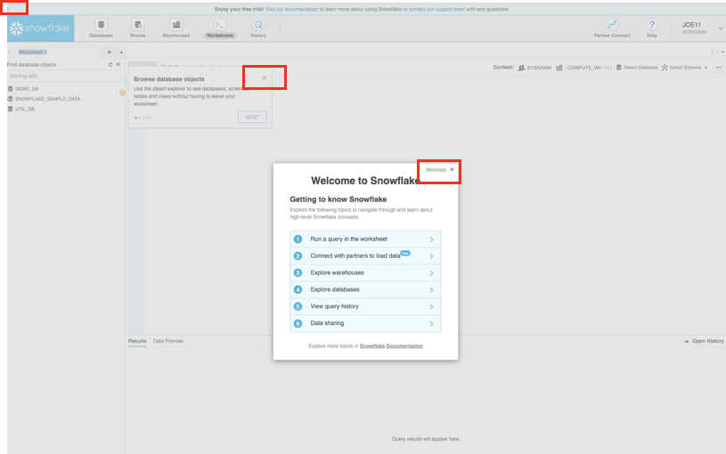
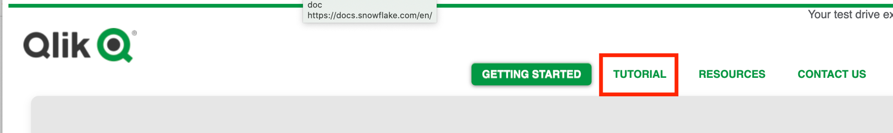
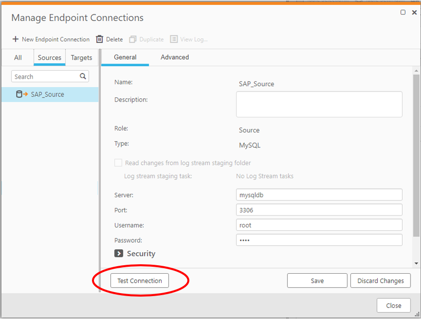
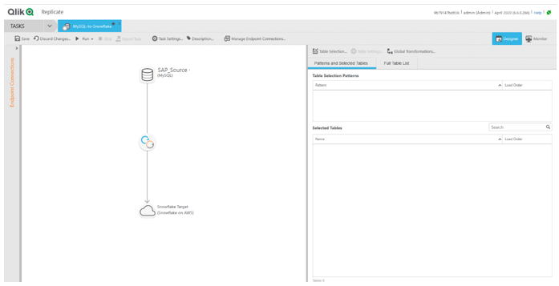
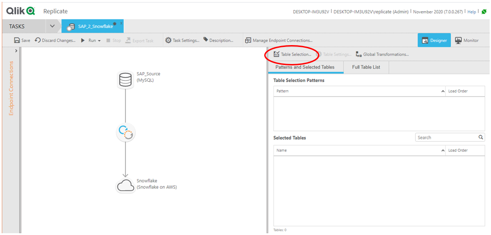
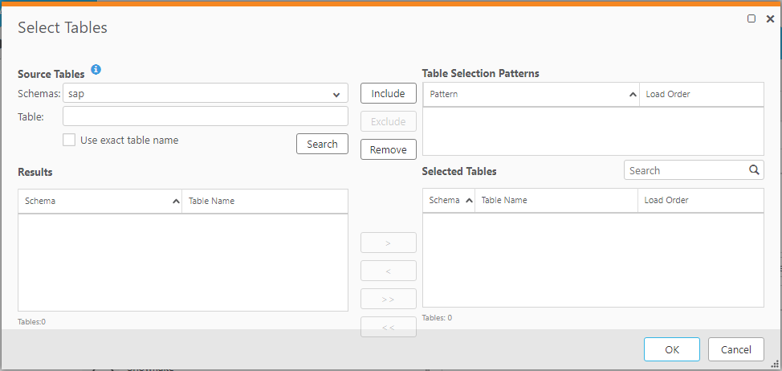
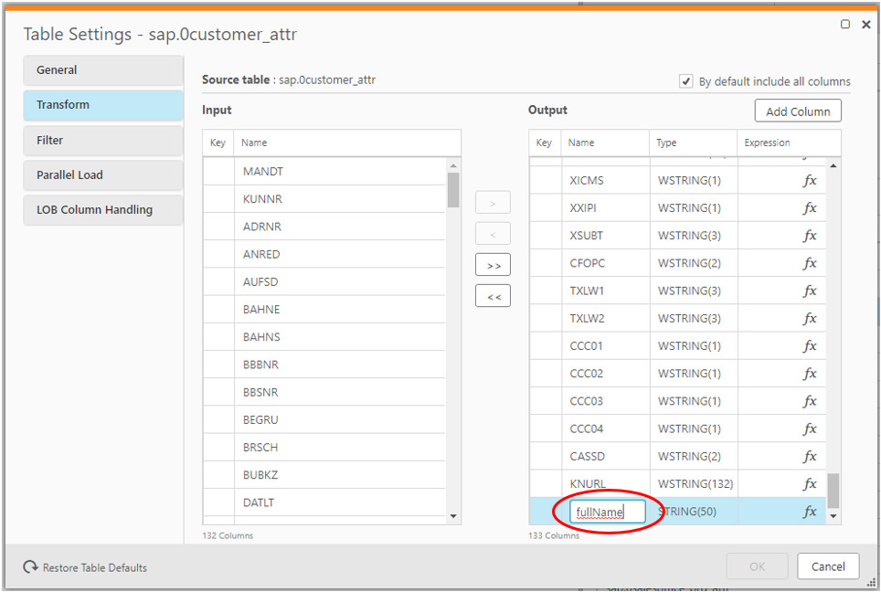
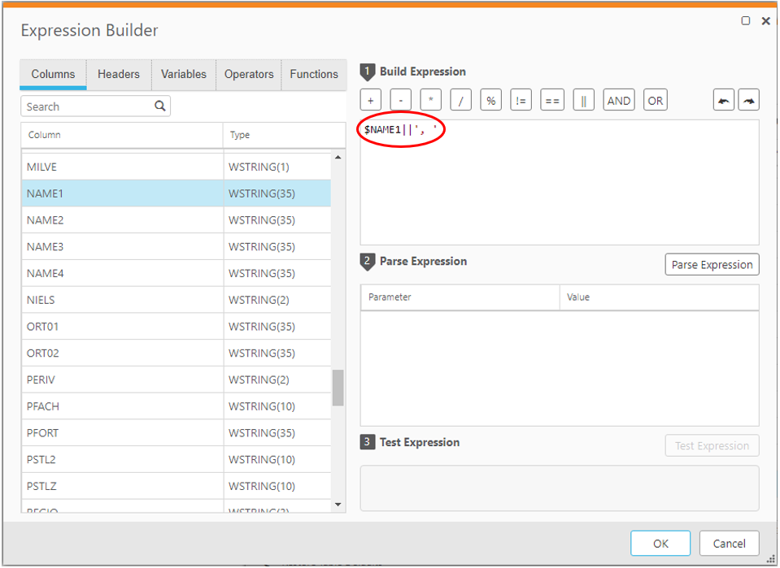
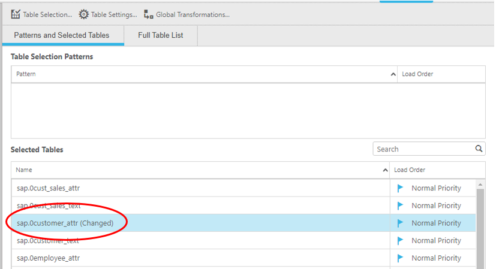

summary: Qlik VHOL
id: qlik_vhol
categories: patterns
tags: patterns, security, rbac, objects, access
status: Published 

# QLIK VHOL

HANDS-ON LAB GUIDE: REPLICATE SAP DATA TO SNOWFLAKE WITH QLIK  

To be used with the Snowflake free 30-day trial at:  
[https://trial.snowflake.com](https://trial.snowflake.com/)  

Works for any Snowflake edition or cloud provider

Approximate duration: 90 minutes. Approximately 5 credits used.

## 

## Table of Contents

[Lab Overview]()

[Module 1: Prepare Your Lab Environment]()

[Module 2: The Snowflake User Interface & Lab “Story”]()

[Module 3: Create a Database]()

[Module 4: Setting up Qlik Replicate through Snowflake Partner Connect]()

[Module 5: Verifying Snowflake as the Target Connection]()

[Module 6: Set up Source Connection to Source Database]()

[Module 7: Configure Your Task]()

[Module 8: Run your Task]()

[Module 9: Using Unique Snowflake Features to Improve Development Productivity]()

[Module 10: Mix Data from Snowflake’s Data Marketplace]()

[Summary & Next Steps & Clean-Up]()

## Lab Overview

This entry-level lab introduces you to Snowflake’s Data Cloud and Qlik Replicate and how to replicate SAP data into Snowflake. It is designed specifically for use with the Snowflake, free 30-day trial at [https://trial.snowflake.com](https://trial.snowflake.com/). After familiarizing yourself with Snowflake you will then access Qlik Replicate. When you’ve completed the lab you should be ready to transform and load the example SAP data set into Snowflake. Qlik Compose and Qlik Sense \(not covered in the hands-on but they are discussed\) can complete the Qlik/Snowflake solution modeling and reporting solution on SAP data in Snowflake.

### Target Audience

Database and Data Warehouse Administrators and Architects

### High level learning objectives

* How to replicate SAP data into Snowflake using Qlik Replicate
* Highlight unique Snowflake features, such as
  * Zero-copy cloning
  * Multi-cluster virtual warehouses
  * Data Sharing
* Highlight how Qlik’s product suite can add value to Snowflake, such as
  * Replication
  * Dashboards

### You'll learn how to:

* Navigate the Snowflake UI
* Create a database and compute resources
* Use unique features including Snowflake Zero-Copy Cloning and Time Travel
* Configure virtual warehouse compute clusters
* Use Qlik Replicate to create a source and target endpoint
* Configure Replicate to use Snowflake internal staging
* Configure a Replicate task
* Configure a transformation and test the expression
* Run your task
* Connect to Snowflake marketplace and blend weather data with company location information

### Prerequisites

* Use of the Snowflake free 30-day trial environment
* Basic knowledge of SQL, and database concepts and objects

### Steps to Prepare Your Lab Environment

#### If not yet done, register for a Snowflake free 30-day trial at [https://trial.snowflake.com](https://trial.snowflake.com/)

#### The Snowflake edition \(Standard, Enterprise, e.g.\), cloud provider \(GCP, AWS, or Azure\), and Region \(US Central, Europe West, e.g.\) do \*not\* matter for this lab. But we suggest you select the region which is physically closest to you. And select the Enterprise edition so you can leverage some advanced capabilities that are not available in the Standard Edition. 

#### After registering, you will receive an email with an activation link and your Snowflake account URL. Bookmark this URL for easy, future access. After activation, you will create a username and password. Write down these credentials.

#### Resize your browser windows so you can view this lab guide PDF and your web browser side-by-side to more easily follow the lab instructions. If possible, even better is to use a secondary display dedicated to the lab guide.

#### Click on [lab\_scripts.sql](https://snowflake-corp-se-workshop.s3-us-west-1.amazonaws.com/VHOL_Snowflake_Qlik/Snowflake_Qlik_VHOL.sql) we will use this file later in the lab.

## The Snowflake User Interface

<table>
  <thead>
    <tr>
      <th style="text-align:left">
        
      </th>
      <th style="text-align:left">
        
<b>About the screen captures, sample code, and environment</b>
        

        
Screen captures in this lab depict examples and results that may slightly
          vary from what you may see when you complete the exercises.

      </th>
    </tr>
  </thead>
  <tbody></tbody>
</table>

### Logging Into the Snowflake User Interface \(UI\)

#### Open a browser window and enter the URL of your Snowflake 30-day trial environment.

#### You should see the login screen below. Enter your unique credentials to log in.

#### Close any Welcome Boxes and Tutorials

* * 1. You may see “welcome” and “helper” boxes in the UI when you log in for the first time. Also a “Enjoy your free trial…” ribbon at the top of the UI. Minimize and close them by clicking on the items in the red boxes in the screenshot below.

### Navigating the Snowflake UI

First let’s get you acquainted with Snowflake! This section covers the basic components of the user interface to help you orient yourself. We will move left to right in the top of the UI.

#### The top menu allows you to switch between the different areas of Snowflake:

#### The **Databases** tab shows information about the databases you have created or have privileges to access. You can create, clone, drop, or transfer ownership of databases as well as load data \(limited\) in the UI. Notice several databases already exist in your environment. However, we will not be using these in this lab.

#### The **Shares** tab is where data sharing can be configured to easily and securely share Snowflake table\(s\) among separate Snowflake accounts or external users, without having to create a second copy of the table data.

#### The **Data Marketplace** tab allows you to navigate to Snowflake’s data marketplace where companies publish data catalogs that you can try out and mix with your data. It is live, secure, data sharing at scale. Some data is free, other data requires a paid subscription.

#### The **Warehouses** tab is where you set up and manage compute resources \(virtual warehouses\) to load or query data in Snowflake. Note a warehouse called “COMPUTE\_WH \(XS\)” already exists in your environment.

#### The **Worksheets** tab provides an interface for submitting SQL queries, performing DDL and DML operations and viewing results as your queries/operations complete. The default “Worksheet 1” appears.In the left pane is the database objects browser which enables users to explore all databases, schemas, tables, and views accessible by the role selected for a worksheet. The bottom pane shows results of queries and operations.The various windows on this page can be resized by moving the small sliders on them. And if during the lab you need more room to work in the worksheet, collapse the database objects browser in the left pane. Many of the screenshots in this guide will have this database objects browser closed.

#### At the top left of the default “Worksheet 1,” just to the right of the worksheet tab, click on the small, downward facing arrow, select “Load Script”, then browse to the “[Snowflake\_Qlik\_VHOL.sql](https://snowflake-corp-se-workshop.s3-us-west-1.amazonaws.com/VHOL_Snowflake_Qlik/Snowflake_Qlik_VHOL.sql)” file you downloaded in the prior module and select “Open”. All of the SQL commands you need to run for the remainder of this lab will now appear on the new worksheet. Do not run any of the SQL commands yet. We will come back to them later in the lab and execute them one at a time.

#### 

<table>
  <thead>
    <tr>
      <th style="text-align:left">
        
      </th>
      <th style="text-align:left">
        
<b>Warning - Do Not Copy/Paste SQL From This PDF to a Worksheet</b>
        

        
Copy-pasting the SQL code from this PDF into a Snowflake worksheet will
          result in formatting errors and the SQL will not run correctly. Make sure
          to use the &#x201C;Load Script&#x201D; method just covered.
           
        

        
On older or locked-down browsers, this &#x201C;load script&#x201D; step
          may not work as the browser will prevent you from opening the .sql file.
          If this is the case, open the .sql file with a text editor and then copy/paste
          all the text from the .sql file to the &#x201C;Worksheet 1&#x201D;

      </th>
    </tr>
  </thead>
  <tbody></tbody>
</table>

<table>
  <thead>
    <tr>
      <th style="text-align:left">
        
      </th>
      <th style="text-align:left">
        
<b>Worksheets vs the UI</b>
        

        
Much of the configurations in this lab will be executed via this pre-written
          SQL in the Worksheet in order to save time. These configurations could
          also be done via the UI in a less technical manner but would take more
          time.

      </th>
    </tr>
  </thead>
  <tbody></tbody>
</table>

#### The **History** tab allows you to view the details of all queries executed in the last 14 days in the Snowflake account \(click on a Query ID to drill into the query for more detail\).

#### If you click on the top right of the UI where your user name appears, you can change your password, roles, or preferences. Snowflake has several system defined roles. You are currently in the default role of SYSADMIN but sometimes we will change this to the ACCOUNTADMIN role.

<table>
  <thead>
    <tr>
      <th style="text-align:left">
        
      </th>
      <th style="text-align:left">
        
<b>SYSADMIN</b>
        

        
For this lab you will use SYSADMIN (aka System Administrator) role which
          has privileges to create warehouses and databases and other objects in
          an account. You will also use the ACCOUNTADMIN role to access account-level
          objects.

        
In a real-world environment, you would use different roles for the tasks
          in this lab, and assign the roles to your users. More on access control
          at <a href="https://docs.snowflake.net/manuals/user-guide/security-access-control.html">https://docs.snowflake.net/manuals/user-guide/security-access-control.html</a>
        

      </th>
    </tr>
  </thead>
  <tbody></tbody>
</table>

## The Story

Your business would like to pull in and transform some customer data. First you create a database and some schemas under the database to prepare your environment. Then you will use Qlik Replicate to replicate the data and keep it updated in Snowflake. Once the data is in Snowflake you will make a CLONE of some of the data into the sandbox schema using zero-copy clone to work in a safe and isolated environment with its own computational cluster. You will also see how to recover from accidental deletion of a table using our UNDROP function.

### Create a Database

#### In the upper right corner of the Web UI, change your user role to SYSADMIN.

#### Create a database named SAP that will be used to put our SAP data. 

At the top of the UI select the “Databases” tab. Then click on  “Create” and name the database “SAP” and click “Finish”.

#### Now let’s create some schemas under the database SAP, to separate out our sandbox, staging, integration and presentation layers. Click on the “SAP” database name, on “Schemas”, and Create, add the name “Sandbox”, and click “Finish”.

Repeat the above to create three other schemas:

1. Staging
2. Integration
3. Presentation

When you’re done, you should have four schemas in total:

**Note**: For all databases two other schemas are automatically created, Public, which is initially empty and is the default schema, and Information\_Schema, which contains views for all the objects contained in the database, views for account-level objects \(i.e. non-database objects such as roles, warehouses, and databases\), and table functions for historical and usage data across your account.

We could create tables right now, either through the UI or through the worksheets, but since we are using Qlik Replicate, we will let it create all that later in the lab. Once you complete the Qlik Replicate part of the lab, we will come back to the Snowflake interface and use zero-copy clone to bring a clone of the tables into our sandbox so we can play without impacting other users or production data.

## Setting up Qlik Replicate through Snowflake Partner Connect

Qlik Replicate is an Enterprise Data Replication tool built to move large volumes of data quickly and efficiently to the cloud and then keep the cloud data target synchronized in real-time.

In this exercise with Snowflake we’ll be exploring its capabilities to replicate SAP data to Snowflake and then keep that data set synchronised in real-time, meaning as Inserts/Updates/Deletes are performed against the SAP data set, we’ll see those same changes occur against the replicated data set in Snowflake.

### Setup your Email for your Qlik Account in Snowflake

In one of the next steps in the setup to Qlik, Qlik will send an email to you. In order to receive this email, you need to first setup a real email address in the Snowflake user account that has the ACCOUNTADMIN role:

#### Click on your name in the upper right of the Snowflake Web UI and Switch Role to ACCOUNTADMIN 

#### Click on your name again and select Preferences.

The following pop-up appears:

#### Click Change Email address and add an accurate and accessible email address, or confirm that an email address has been filled out, and click OK.

### Set up Qlik Replicate from Partner Connect

#### Verify your role is ACCOUNTADMIN.

#### Select the Partner Connect button at the top right of the page: 

#### Select Qlik \(Attunity\)

The following popup appears:

Qlik Replicate will use this database, user, warehouse and role to set up a destination end-point in Qlik Replicate.

#### **Option 1: Continue within the Snowflake page.**

#### Select Connect or Launch and provide your first and last name if required. You may get an error page at this point. That’s ok. Go and check your email in the next step and get your individual link from there. You should see a popup, saying that your Qlik account has been created:

####  

#### Click on “Activate” to activate your Qlik account. If you get an error here, check your email for a welcome letter from [noreply@qlik.com](mailto:noreply@qlik.com) with the heading “Welcome to your Qlik Replicate test drive for Snowflake Partner Connect”

#### 

#### Click on the link in the email. The following opens in a browser.

Fill in your details and click Submit.

Please note that it may take up to 10 seconds to refresh.

If the page is not refreshed after 10 seconds, refresh your browser.

You should now see this page:

#### Scroll down to the hyperlink that will launch Qlik Replicate.

#### **Remember the user \(admin\) and copy your individual password for the next step. Note that this password will be used for your root user \(later for setting up endpoints\), so make a note!**

#### Click on the link. A pop-up will appear. Add admin as the user name and the password you copied in the previous step and click OK. The Qlik Replicate UI appears: 

Great, now you are ready to set up your connections and tasks! Please continue to the next section.

## Verifying Snowflake as the Target Connection

The first thing we need to do is verify the target endpoint from Qlik to Snowflake that was generated when you launched Partner Connect.

#### Clicking the Manage Endpoint Connections button at the top of the screen. If you don’t see it, make your window a bit wider and it should appear.

The below panel appears. The Snowflake to Qlik Partner Connect has already set up a target connection to your Snowflake instance. If not, please ask for help in the Q&A.

#### Click on Test Connection. You will get a test successful message that pops up.

TIP! If not successful, Select More Details. If you get the message that the incorrect username or password was specified, go into Snowflake as USERADMIN or ACCOUNTADMIN and reset the password for PC\_ATTUNITY\_USER \(uncheck Force password change\). Then back in Qlik, change the password to the new password as well.

## Set up Source Connection to Source Database

Now we need to set up the source connection to get to the SAP tables. In this lab these tables are stored in a MySQL database, but Qlik does provide a connector to SAP HANA. You can, at a later point, test that connector against your HANA system.

Warning! As a prerequisite to setting up the connection to the MySQL database, you need to recover the password from the tutorial.

#### Access the the tutorial page you accessed in Section 4.2.6

#### At the top of that page, select Tutorial:

#### Scroll down to near the bottom of the tutorial and copy the password for the user root:

### Add New End Point

Returning to Qlik Replicate, click on Manage Endpoints from the main screen:

From there, click on Add New Endpoint Connection link or the + New Endpoint Connection button at the top left of the screen. The Manage Endpoint Connections window appears:

We will now create a MySQL source endpoint \(we have landed the SAP tables in MySQL for this hands-on lab\):

* Replace the text **New Endpoint Connection 1** with something more descriptive like SAP\_Source
* Make sure the Source radio button is selected, and then select MySQL from the dropdown selection box.

You will notice as we proceed that the content of the configuration window is context-sensitive.

Fill in the blanks as indicated in the images above:

* Server: mysqldb
* Port: 3306
* User: root
* Password: You need to get this from the tutorial page as explained in Section 6.1
* Security/SSL Mode: None

...and then click on Test Connection. Your screen should look like the following, indicating that your connection succeeded.

Assuming so, click Save and the configuration of your MySQL source endpoint is complete. Click Close to close the window.

## Configure Your Task

Now that we have configured our MySQL source and Snowflake target endpoints, we need to tie them together in what we call a Replicate task. In short, a task defines the following:

A source endpoint

A target endpoint

The list of tables that we want to capture

Any transformations we want to make on the data

#### To get started, we need to create a task. Click on the + New Task button at the top of the screen.

Once you do, a window like this will pop up:

Give this task a meaningful name like SAP\_Source-to-Snowflake. For this task we will use these values:

* Name: SAP\_Source-to-Snowflake
* Replication Profile: Unidirectional
* Task Options
  * Full Load: enabled _\(Blue highlight is enabled; click to enable / disable.\)_
  * Apply Changes: enabled _\(Blue highlight is enabled; click to enable / disable.\)_
  * Store Changes: disabled _\(Blue highlight is enabled; click to enable / disable.\)_

Once you have everything set, press OK to create the task. When you have completed this step you will see a window that looks like this:

Qlik Replicate is all about **ease of use**. The interface is point-and-click, drag-and-drop. To configure our task, we need to select a source endpoint \(MySQL\) and a target endpoint \(Snowflake\). You can either drag the SAP\_Source endpoint from the box on the left of the screen and drop it into the circle that says Drop source endpoint here, or you can click on the arrow that appears just to the right of the endpoint when you highlight it.

Repeat the same process for the Snowflake Target endpoint. Your screen should now look like this:

Our next step is to select the tables we want to replicate from SAP\_Source into Snowflake. Click on the Table Selection... button in the top centre of your browser.

and from there select the sap schema.

Enter % where it says **Table:** and press the Search button. This will retrieve a list of all the tables in the _sap_ schema.

_Note: entering % is not strictly required. By default, Qlik Replicate will search for all tables \(%\) if you do not limit the search._

and then press the &gt;&gt; button to move all of the tables from the **Results** list into the **Selected Tables** list. Note that we also had the option of simply wildcarding all tables, or selectively choosing tables from the **Results** list.

Click the “OK” button. In the next step we will configure a transformation on some of the data.

### Configure a Transformation

Replicate is able to perform transformations on the data as it moves from source to target. In this step we will create a transformation that will:

* Add a new column **fullName** to the **0customer\_attr \(KNA1\)** target table
* Populate that column with values from other columns in the table.

To get started, double click on the **0customer\_attr** table in the **Selected Tables** frame.

Then click on the Transform button.

And click on Add Column.

Call the new column fullName,

and change its default type from **STRING\(50\)** to WSTRING\(100\). You can get a dropdown of valid types you can choose by clicking the **type** column next to **fullName**.

Note though, that the default precision of the WSTRING type is 50 … we will need more space than that due to the width of some of the data we will be working with, so you will need to type WSTRING\(100\) into the **type** column.

Now we need to define the transformation we want to use to populate the column. Click on fx to bring up the transformation **Expression Builder**.

The expression we are going to build will involve concatenating two columns, _NAME1_ and _NAME2_ into a column called _fullName_. Start by double clicking NAME1 which will put **$NAME1** into the expression builder.

Now press the concatenation operator \|\| and add the string ’, ‘

Add another concatenation operator to the end, and then append NAME2. You will have an expression that looks like:

**$NAME1\|\|', '\|\|$NAME2**

Note that you could just as easily have typed the expression in directly, or even copied and pasted it from this document.

Now click the Parse Expression button and enter the data:

* $NAME1: Joe
* $NAME2: Bloggs

and press the Test Expression button. This process allows us to put test values in the columns that make up the expression and validate that the output looks as we expect it to.

Assuming your output looks like the output indicated \(**Joe, Bloggs**\), your transformation is correct. Press OK to save the transformation and return to the previous screen.

You will note below that we can see that there is now an expression next to the **fullName** column. If you hover your mouse over that column you will be able to inspect the transformation without having to click into it. Press OK again to return to the previous screen.

Notice the word **\(Changed\)** next to the _0customer\_attr_ row. This indicates that a transformation has been defined that alters the state of the data as it moves from the source to the target.

That is it for configuration. We are now ready to save our task and run it. Press Save at the top left of the window and then press Run.

## Run Your Task

After you press Run, Replicate will automatically switch from **Designer** mode to **Monitor** mode. You will be able to watch the status of the full load as it occurs, and then switch to monitoring change data capture as well.

When **Full Load** is complete, click on the Completed bar to display the tables.

There is DML activity running in the background. Click on the Change Processing tab to see it in action.

## Using Unique Snowflake Features to Improve Development Productivity

### Use Zero-Copy Cloning—Clone a Table

Snowflake allows you to create clones, also known as “zero-copy clones” of tables, schemas, and databases in seconds. A snapshot of data present in the source object is taken when the clone is created, and is made available to the cloned object. The cloned object is writable, and is independent of the clone source. That is, changes made to either the source object or the clone object are not part of the other.

A popular use case for zero-copy cloning is to clone a production environment for use by Development & Testing to do testing and experimentation \(1\) without adversely impacting the production environment and \(2\) eliminating the need to set up and manage two separate environments for production and Development & Testing.

<table>
  <thead>
    <tr>
      <th style="text-align:left">
        
      </th>
      <th style="text-align:left">
        
<b>Zero-Copy Cloning!</b>
        

        
A massive benefit is that the underlying data is not copied; just the
          metadata/pointers to the underlying data change. Hence &#x201C;zero-copy&#x201D;
          and storage requirements are not doubled when data is cloned. Most data
          warehouses cannot do this; for Snowflake it is easy!

      </th>
    </tr>
  </thead>
  <tbody></tbody>
</table>

#### Run the following commands in the worksheet to clone the customer table from the Qlik Attunity database into a sandbox table.

use role sysadmin;

use database sap;

use schema sandbox;

create or replace table "CUSTOMER\_SBX" clone "PC\_ATTUNITY\_DB"."sap"."0customer\_attr";

#### If closed, expand the database objects browser on the left of the worksheet. Click the small **Refresh** button in the left-hand panel and expand the object tree under the SAP database. Check that you can see a new table under the SAP database named CUSTOMER\_SBX. The development team now can do whatever they want with this table, including even deleting it, without having any impact on the 0customer\_attr table or any other object. 

### Create a Warehouse

To completely separate your sandbox environment create a separate virtual warehouse. Run this command to do that:

create warehouse if not exists wh\_sandbox warehouse\_size = 'xsmall' auto\_suspend = 60 initially\_suspended=true;

and then for your worksheet, use the use command to use the warehouse:

use warehouse wh\_sandbox;

### Drop and Undrop a Table

Let’s see how we can restore data objects that have been accidentally or intentionally deleted.

#### From the worksheet, run the following command which will drop \(remove\) the CUSTOMER\_SBX table:

#### drop table CUSTOMER\_SBX;

#### Now run a SELECT statement on the CUSTOMER\_SBX table. In the “Results” pane you should see an error because the underlying table has been dropped.

select \* from CUSTOMER\_SBX limit 10;

#### Now restore the table:

undrop table customer\_sbx;

#### The CUSTOMER\_SBX table is now restored:

### Use Time Travel

Snowflake’s Time Travel capability enables accessing historical data at any point within a pre-configurable period of time. The default period of time is 24 hours and with Snowflake Enterprise Edition it can be up to 90 days. Most data warehouses cannot offer this functionality; with Snowflake it is easy!

Some useful applications of this include:

* Restoring data-related objects \(tables, schemas, and databases\) that may have been accidentally or intentionally deleted
* Duplicating and backing up data from key points in the past
* Analysing data usage/manipulation over specified periods of time

##  Mix Data from Snowflake’s Data Marketplace

Snowflake’s Data Marketplace provides over 100 data sets of consumable data provided by other customers of Snowflake ranging from Finance to Health to Travel, see below:

Snowflake’s Data Marketplace makes the sharing and consumption of this data seamless and frictionless. No more files to export, compress, manage or wait for. The data from the Data Marketplace shows up like another database in your system, which you can combine with your other data sets on common fields such as city and country, depending on the dataset. The example below combines customer demographic information with up-to-date weather data.

###  Weather Data from Snowflake’s Data Marketplace

So what is the first thing a salesperson does when they contact a client? Well, most of the time they talk about the weather. But what if the salesperson is working remotely? With Snowflake’s data sharing it is easy to get up-to-date information simply by going to the Data Marketplace and requesting the data.

#### In the Snowflake Web UI, switch your role \(top right\) to ACCOUNTADMIN. Select Data Marketplace, and then Explore the Snowflake Data Marketplace.

The following or similar screen appears:

In the search box, enter the search term “weather”, as below, and then select the Global Weather & Climate Data for BI from Weather Source:

The following screen appears:

Select Get Data, and the following screen appears. Change the database name to weather as below and accept the terms:

Click on Done and go back to the Snowflake Web UI, and Select the Worksheets Tab. Ensure that the context role for your worksheet is set to ACCOUNTADMIN. Check in the left panel to make sure you now see the weather database:

To find out the average temperature per city for each customer, you can use the following commands in the worksheet to check the data in the two tables, and then combine the weather data with the SAP customer data that you’ve brought in from Qlik Replicate:

use role accountadmin;

use warehouse WH\_SANDBOX;

use database "weather";

select \* from history\_day limit 10;

select \* from "SAP"."SANDBOX"."CUSTOMER\_SBX" limit 10;

select

upper\(ernam\) as Customer,

upper\(ort01\) as City,

land1 as Country,

avg\(AVG\_TEMPERATURE\_AIR\_2M\_F\) as Temperature\_deg\_f,

max\(date\_valid\_std\) as TemperatureDate

from "SAP"."SANDBOX"."CUSTOMER\_SBX"

inner join "weather"."PUBLIC"."HISTORY\_DAY"

where pstlz=postal\_code group by 1,2,3 order by 1,2;

Double bonus! If you have extra time, consider doing a similar exercise, but this time with the pandemic data provided by Starschema, also found in Snowflake’s Data Marketplace.

## Summary & Next Steps

This tutorial was designed as a hands-on introduction to Snowflake to simultaneously teach you how to use it, while showcasing some of its key capabilities and differentiators. We covered how to navigate the UI, create databases and warehouses, and work with Qlik Replicate.

We encourage you to continue with your free trial by loading in your own sample or production data and by using some of the more advanced capabilities of Snowflake not covered in this lab. There are several ways Snowflake can help you with this:  

* At the very top of the UI click on the “Partner Connect” icon to get access to trial/free ETL and BI tools to help you get more data into Snowflake and then analyze it
* Read the “Definitive Guide to Maximizing Your Free Trial” document at: [https://www.snowflake.com/test-driving-snowflake-the-definitive-guide-to-maximizing-your-free-trial/](https://www.snowflake.com/test-driving-snowflake-the-definitive-guide-to-maximizing-your-free-trial/)
* Contact Sales to learn more [https://www.snowflake.com/free-trial-contact-sales/](https://www.snowflake.com/free-trial-contact-sales/)

## 12 Clean-up

If you would like to clean up your Snowflake environment and delete the connection, databases, user and role that was created within Qlik Replicate, use this optional command. Once you run these commands, your connection to Qlik will be deleted.

use role accountadmin;

select system$remove\_etl\_integration\('attunity'\);

